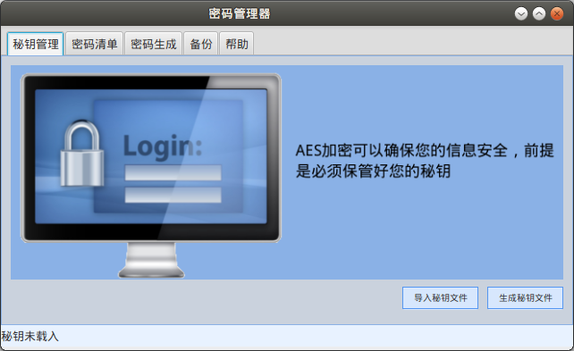

# PasswordManager_v2 Client
##Manage your password and keep it safe with AES
##Features
* Manage your secret key
* manage all your account and password
* synchronise data with your family on a local network server
* encrypt data with AES 128
##How to install
* Make sure you have installed JRE8(supports Javafx) on your system and configure path correctly
* Extract the .tar.bz2 file anywhere you want and use the shell script file to launch the application
***
# 桌面密码管理器
##统一管理密码的桌面程序，AES加密保证数据的安全
##特性
* 秘钥管理
* 管理所有账户密码
* 和家庭局域网的服务器进行同步
* 采用AES128位加密
##如何安装并运行
* 运行需要系统安装支持javafx的JRE8并正确配置环境变量
* 将压缩文件解压到你需要的地方，并使用启动脚本运行程序
***
###Screenshots 运行截图
